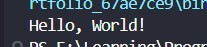

<div align="center">

# 🚀 Java Learning Portfolio

### Building My Full Stack Development Journey, One Lesson at a Time.


<br><br>

<a href="https://github.com/mr-nexora">

</a>

<a href="https://www.linkedin.com/in/mrnexora/">

</a>

<a href="https://mr-nexora.github.io/mr-nexora-personal-portfolio/">

</a>

</div>

---

# 👋 Welcome

Welcome to my **Java Learning Repository**.

## This repository documents my complete learning journey in Java as part of my Full Stack Development roadmap. Every lesson includes well-organized source code, explanations, screenshots, practice exercises, and mini projects to strengthen my object-oriented programming, problem-solving, and application development skills.

# 📂 Repository Overview

| 📌 Information        | Details                                    |
| :-------------------- | :----------------------------------------- |
| 👨‍💻 Author             | **T.M.S.U. Thennakoon (Sahan Udara)**      |
| 🎓 Program            | Computer Science Undergraduate             |
| 💻 Technology         | Java                                       |
| 📚 Learning Method    | Daily Lessons & Hands-on Practice          |
| 🎯 Goal               | Become a Professional Full Stack Developer |
| 📅 Repository Started | 2026                                       |

---

# ✨ What's Inside

- 📖 Structured Lessons
- 💻 Source Code
- 📷 Output Screenshots
- 📝 Markdown Notes
- 🚀 Mini Projects
- 📚 Practice Exercises
- 📈 Continuous Progress Updates

---

# 🌍 Connect With Me

<div align="center">

<a href="https://github.com/mr-nexora">

</a>

<a href="https://www.linkedin.com/in/mrnexora/">

</a>

<a href="https://mr-nexora.github.io/mr-nexora-personal-portfolio/">

</a>

</div>

---

# 📚 Learning Resources

This repository is built through continuous practice using educational resources such as:

- W3Schools
- MDN Web Docs
- freeCodeCamp

---

# ⚖️ Copyright

> **© 2026 T.M.S.U. Thennakoon (Sahan Udara). All Rights Reserved.**
>
> This repository has been created for educational, portfolio, and personal learning purposes.
>
> You are welcome to explore the code and learn from it. However, copying, redistributing, or presenting this work as your own without permission is not allowed.

---

<div align="center">

⭐ If you find this repository useful, consider giving it a Star.

Happy Coding! 🚀

</div>

---

# Java Introduction and Setup

## Java Intro

- Welcome to the first step of your Java journey! This lesson covers the absolute essentials of Java, including its history, why we use it, how to set up your development environment, and compiling your very first program.

---

## 📖 1. Java Introduction

### What is Java?

Java is a high-level, class-based, object-oriented programming language designed to have as few implementation dependencies as possible. Developed by **James Gosling** at **Sun Microsystems** in 1995 (now owned by **Oracle**), Java is one of the most popular programming languages in the world.

### Why Choose Java?

- **Platform Independence:** Java follows the **WORA** principle—_Write Once, Run Anywhere_. Code compiled on Windows can run on macOS, Linux, or any other platform without modification.
- **Object-Oriented (OOP):** Everything in Java is associated with Classes and Objects, making the code modular, reusable, and organized.
- **Secure and Robust:** Java has no explicit pointers, runs inside a secure virtual machine (JVM), and manages memory automatically via Garbage Collection.
- **Massive Community Support:** From enterprise-level backends, Android app development, to financial software, Java has rich libraries and an active community.

---

## ⚙️ 2. Java Get Started (JDK Setup & IDE Configuration)

Before writing any Java code, you need to install the software tools that compile and execute your programs.

### Key Components of Java Architecture

1. **JDK (Java Development Kit):** The full software development kit containing compiling tools (javac), documentation, and debugging utilities. It includes the JRE and JVM.
2. **JRE (Java Runtime Environment):** Provides the minimum requirements for executing a Java application (standard libraries and the JVM).
3. **JVM (Java Virtual Machine):** The engine that actually runs the compiled Java bytecode on your machine.

---

### Step 1: Install the JDK (Java Development Kit)

1. Download the latest JDK (version 17 or 21 LTS is highly recommended) from the official [Oracle Website](https://www.oracle.com/java/technologies/downloads/) or adopt open-source builds like OpenJDK.
2. Run the installer and follow the prompt instructions.
3. **Set Environment Variables (Crucial for Terminal Execution):**
   - **On Windows:**
     - Search for "Environment Variables" in Windows Search.
     - Click **Environment Variables** under System Properties.
     - Under "System variables", click **New** to create `JAVA_HOME` pointing to your JDK installation path (e.g., `C:\\Program Files\\Java\\jdk-21`).
     - Locate the `Path` variable, click **Edit**, and add `%JAVA_HOME%\\bin` to the list.
   - **On macOS/Linux:**
     - Add `export JAVA_HOME=/path/to/your/jdk` and `export PATH=$JAVA_HOME/bin:$PATH` to your `~/.bash_profile`, `~/.bashrc`, or `~/.zshrc` file.

Verify your installation by running this command in your terminal:
Code output
SUCCESS

```bash
java -version
javac -version
```

## Step 2: IDE Configuration

To write your code efficiently, use a modern Integrated Development Environment (IDE). Popular choices are:

### IntelliJ IDEA (Community Edition): Highly recommended for absolute Java development due to its smart autocomplete, refactoring, and project structuring.

### VS Code: Lightweight and great when configured with the "Extension Pack for Java".

## 💻 3. Writing Your First Code

Here is your first test program. We define a public class test1 and print a classic hello message to the terminal.

```java
    /* test1.java */
    public class test1 {
        public static void main(String[] args) {

            System.out.println("Hello, World!");
        }
    }
```

## 

### Understanding the Code Structure:

#### public class test1:

In Java, every line of executable code must reside inside a class. The class name must match the filename exactly (i.e., test1.java).

#### public static void main(String[] args):

This is the entry point of any Java application. The JVM looks for this exact method signature to start executing the program.

#### System.out.println():

A built-in system method used to output text inside the parentheses followed by a new line.

---

## 🛠️ 4. Compilation & Execution

Java is both a compiled and interpreted language. To execute the code, follow these terminal steps inside your workspace folder:

### 1. Compile the Source Code

This step converts your readable .java file into JVM-readable Bytecode (.class file):

```bash
    javac test1.java
```

After running this, you will see a new file generated in your directory named test1.class.

## 2. Run the Compiled Class

Use the JVM interpreter to run the generated bytecode:

```bash
    java test1
```

---
