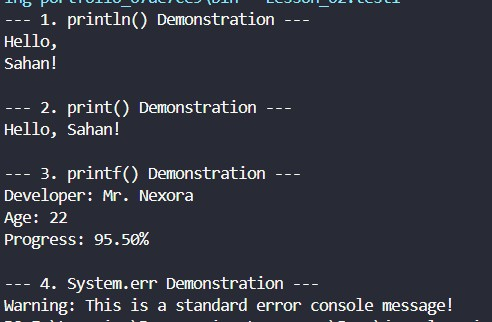

# ☕ L02: Java Syntax & Output

Welcome to the second lesson of your Java journey! In this lesson, we will dissect the structural grammar (Syntax) of a Java program and explore the various methods available to print outputs to the console.

---

## 📖 1. Java Syntax

Java syntax is the set of rules defining how a Java program is written and interpreted. Understanding this structure is essential for writing error-free code.


### Key Components of Java Syntax:

1. **The Class Declaration:**
   * Every line of code in Java must live inside a **Class**. 
   * In our example, `public class SyntaxDemo` defines a class named `SyntaxDemo`.
   * **Rule:** The class name *must* exactly match the physical file name (e.g., `SyntaxDemo.java`). Java is **case-sensitive**, so `syntaxdemo` and `SyntaxDemo` are different.

2. **The `main()` Method:**
   * The line `public static void main(String[] args)` is the absolute entry point of any execution.
   * **`public`**: Accessible from anywhere.
   * **`static`**: Can be run without creating an object of the class.
   * **`void`**: Does not return any value.
   * **`main`**: The exact method name the JVM looks for.
   * **`String[] args`**: Accepts parameters as an array of strings from the command line.

3. **Statements and Semicolons:**
   * Each executable instruction is called a **statement** and *must* end with a semicolon (`;`). Missing a semicolon is one of the most common syntax errors in Java.

4. **Curly Braces `{}`:**
   * Curly braces define the beginning and the end of a block of code (like a class or a method).

---

## 🖥️ 2. Java Output (System.out Methods)

To print text or values to the screen, Java uses the built-in `System` class. However, there isn't just one way to print. Depending on your requirement, you can use different stream methods.

### Output Methods Comparison:

| Method | Description | Behavior |
| :--- | :--- | :--- |
| `System.out.print()` | Prints text to the terminal. | Keeps the cursor on the **same line** for the next print. |
| `System.out.println()` | Prints text and inserts a newline. | Moves the cursor to the **next line** automatically. |
| `System.out.printf()` | Prints formatted strings (using specifiers). | Allows complex string formatting (like limiting decimal places). |
| `System.err.println()` | Prints to the standard error stream. | Typically outputs text in **red color** in most IDE consoles. |

---

## 💻 3. Code Implementation

### Source Code: `SyntaxDemo.java`
```java
    /* test1.java */

        // 1. Using println() - Automatic line break
        System.out.println("--- 1. println() Demonstration ---");
        System.out.println("Hello,");
        System.out.println("Sahan!");

        // 2. Using print() - Stays on the same line
        System.out.println("\n--- 2. print() Demonstration ---");
        System.out.print("Hello, ");
        System.out.print("Sahan!");
        System.out.println();

        // 3. Using printf() - Formatted text
        System.out.println("\n--- 3. printf() Demonstration ---");
        String name = "Mr. Nexora";
        int age = 22;
        double progress = 95.5;
        
        // %s = String, %d = Integer, %.1f = Double with 1 decimal place, %n = Newline
        System.out.printf("Developer: %s %nAge: %d %nProgress: %.1f%% %n", name, age, progress);

        // 4. Using System.err - Error output stream (Console displays this in Red)
        System.out.println("\n--- 4. System.err Demonstration ---");
        System.err.println("Warning: This is a standard error console message!");
```


## Java Comments
Comments are non-executable statements in a Java program. The Java compiler (`javac`) completely ignores comments during compilation, meaning they do not affect the execution speed or file size of your compiled bytecode.

### Why Use Comments?
* **Code Documentation:** Explains what the code does, making it readable for other developers or your future self.
* **Code Testing (Commenting Out):** Temporarily disables specific lines of code during debugging without deleting them.

---

### 🟢 Types of Comments in Java

Java supports three distinct types of comments: **Single-Line**, **Multi-Line**, and **Documentation** comments.

#### 1. Single-Line Comments
Single-line comments start with two forward slashes (`//`). Any text between `//` and the end of that specific line is completely ignored by Java.

```java
    // This is a Single-Line Comment
```
### 2. Multi Line Comment
Multi-line comments start with /* and end with */. Any text placed between these delimiters, spanning across multiple lines, is treated as a comment.

```java
    /* This 
    is 
    a 
    Multi-Line 
    Comment */    
```
---

## ⚖️ Copyright & Licensing

**Copyright © 2026 T.M.S.U. Thennakoon (Sahan Udara). All rights reserved.**

This documentation, code implementations, structured syllabus, and associated assets are part of the **Java Zero to Hero** learning roadmap, independently curated, structured, and maintained by **Sahan Udara (Mr. Nexora)** under the umbrella brand **SU Nexora**.

* **Author Profiles:** [GitHub](https://github.com/mr-nexora) | [LinkedIn](https://www.linkedin.com/in/mrnexora/)
* **Permitted Use:** This material is strictly intended for personal education, reference, and open-source project showcasing. You are welcome to study, reference, and fork this repository for non-commercial educational purposes.
* **Restrictions:** Unauthorized duplication, plagiarism, re-hosting, or redistribution of these compiled notes, structural curriculum design, and step-by-step explanations on other websites, courses, or commercial media without explicit prior written consent from the author is strictly prohibited.

*All structural updates, code solutions, and verified execution screenshots belong to the author's personal portfolio assets.*