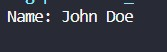
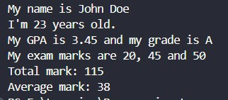
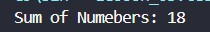
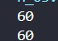
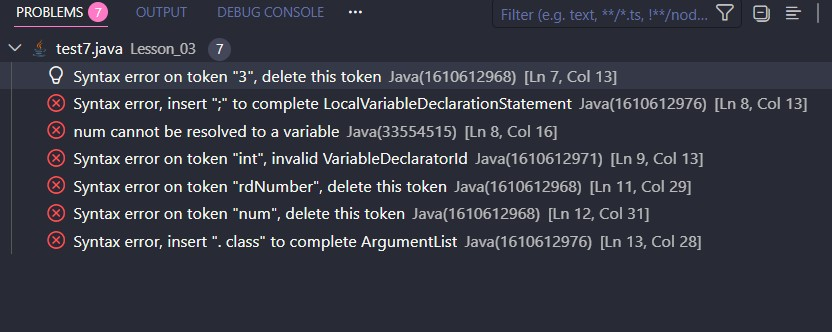
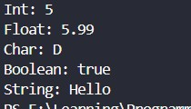
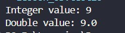
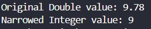

<div align="center">

# 🚀 Java Learning Portfolio

### Building My Full Stack Development Journey, One Lesson at a Time.


<br><br>

<a href="https://github.com/mr-nexora">

</a>

<a href="https://www.linkedin.com/in/mrnexora/">

</a>

<a href="https://mr-nexora.github.io/mr-nexora-personal-portfolio/">

</a>

</div>

---

# 👋 Welcome

Welcome to my **Java Learning Repository**.

## This repository documents my complete learning journey in Java as part of my Full Stack Development roadmap. Every lesson includes well-organized source code, explanations, screenshots, practice exercises, and mini projects to strengthen my object-oriented programming, problem-solving, and application development skills.

# 📂 Repository Overview

| 📌 Information        | Details                                    |
| :-------------------- | :----------------------------------------- |
| 👨‍💻 Author             | **T.M.S.U. Thennakoon (Sahan Udara)**      |
| 🎓 Program            | Computer Science Undergraduate             |
| 💻 Technology         | Java                                       |
| 📚 Learning Method    | Daily Lessons & Hands-on Practice          |
| 🎯 Goal               | Become a Professional Full Stack Developer |
| 📅 Repository Started | 2026                                       |

---

# ✨ What's Inside

- 📖 Structured Lessons
- 💻 Source Code
- 📷 Output Screenshots
- 📝 Markdown Notes
- 🚀 Mini Projects
- 📚 Practice Exercises
- 📈 Continuous Progress Updates

---

# 🌍 Connect With Me

<div align="center">

<a href="https://github.com/mr-nexora">

</a>

<a href="https://www.linkedin.com/in/mrnexora/">

</a>

<a href="https://mr-nexora.github.io/mr-nexora-personal-portfolio/">

</a>

</div>

---

# 📚 Learning Resources

This repository is built through continuous practice using educational resources such as:

- W3Schools
- MDN Web Docs
- freeCodeCamp

---

# ⚖️ Copyright

> **© 2026 T.M.S.U. Thennakoon (Sahan Udara). All Rights Reserved.**
>
> This repository has been created for educational, portfolio, and personal learning purposes.
>
> You are welcome to explore the code and learn from it. However, copying, redistributing, or presenting this work as your own without permission is not allowed.

---

<div align="center">

⭐ If you find this repository useful, consider giving it a Star.

Happy Coding! 🚀

</div>

---
# ☕ L03: Variables & Data Types

Welcome to the third lesson of your Java journey! In this comprehensive guide, we will dive deep into how data is stored, categorized, and named in Java using **Variables**, **Data Types**, **Identifiers**, and the modern **`var` Keyword**.

---

## 📖 1. Java Variables

A **variable** is a container (a dedicated memory location) that holds a value while a Java program is running. Every variable in Java must be declared with a specific data type before it can be used.

### The Declaration Syntax

```syntax
type variableName = value;
```

#### String Variables

Used to store text. String values must be surrounded by double quotes ("...").

```java
    // test1.java
    String myName = "John Doe";
    System.out.println("Name: " + myName);
```



#### Int Variables

Used to store whole numbers without decimals (positive or negative).

```java
    // test1.java
    int myAge = 23;
    System.out.println("Age: " + myAge);
```


#### Float Variables

Used to store fractional numbers containing decimals.

> ⚠️ Crucial Rule: You must append the letter f or F at the end of the literal value to tell the compiler it's a float, not a double.

```java
    // test1.java
    float myGpa = 53.45f;
    System.out.println("GPA: " + myGpa);
```


#### Char Variables

Used to store a single character. Char values must be enclosed in single quotes ('...').

```java
    // test1.java
    char myGrade = 'A';
    System.out.println("Grade: " + myGrade);
```


#### Boolean Variables

Used to store conditional states: either true or false.

```java
    // test1.java
    boolean isStudent = true;
        if (isStudent) {
            System.out.println("Yor are student");
        }
```

## 

#### Final Variables

If you don't want others (or yourself) to overwrite existing variable values, prefix the declaration with the final keyword. This turns the variable into a constant, making it unchangeable and read-only.

```java
    // test2.java
    final int myNum = 15;
    System.out.println("Number: " + myNum);
```

## 

---

### Java Print Variables

#### Display Variables

The + operator can be used to join (concatenate) strings together, or attach variables to regular text layouts during output.

```java
    // test3.java
    String firstName = "John";
        String lastName = "Doe";
        int myAge = 23;
        double myGpa = 3.45;
        char myGrade = 'A';
        int mark1 = 20, mark2 = 45, mark3 = 50;

        System.out.println("My name is " + firstName + " " + lastName);
        System.out.println("I'm " + myAge + " years old.");
        System.out.println("My GPA is " + myGpa + " and my grade is " + myGrade);
        System.out.println("My exam marks are " + mark1 + ", " + mark2 + " and " + mark3);
        System.out.println("Total mark: " + (mark1+mark2+mark3));
        System.out.println("Average mark: " + (mark1+mark2+mark3)/3);
```



### Java Declare Multiple Variables

Java allows you to declare multiple variables of the same type in a single line by separating them with commas.

#### Declare Many Variables

```java
    // test4.java
        int p = 3;
        int q = 5;
        int r = 10;
        int sum = p+q+r;

        System.out.println("Sum of Numebers: " + sum);
```



### One Value to Multiple Variables

You can assign the exact same value to multiple variables across a single statement block using sequential assignment chained together.

```java
    // test5.java
    int x, y, z;
        x = y = z = 10;
        System.out.println("Sum of Numbers: " + (x + y + z));
```


---

### Identifiers

All Java variables must be identified with unique names. These unique names are called Identifiers.

#### Best Practices: Descriptive Names

Always use descriptive names to create self-documenting, maintainable code configurations.

```java
    // test6.java
     // Good
        int minutesPerHour = 60;

    // OK, but not so easy to understand what m actually is
        int m = 60;
```



#### Invalid Identifiers

    - Identifiers can contain letters, digits, underscores, and dollar signs.
    - Identifiers must begin with a letter, $, or _ (Cannot begin with a digit).
    - Identifiers cannot contain whitespace gaps.
    - Identifiers cannot be Java reserved keywords (like int, class, final).

```java
    // test7.java
    int 3rdNumber = 10;
    int my num = 15;
    int int = 40;
```



---

## Java Data Types

Data types in Java are divided into two primary groups:

Primitive Data Types: Includes byte, short, int, long, float, double, boolean, and char. These predefined types store basic, raw values directly.

Non-Primitive Data Types: Includes String, Arrays, and Classes (we will explore these later).

```java
    // test8.java
    int myNum = 5; // Integer (whole number)
    float myFloatNum = 5.99f; // Floating point number
    char myLetter = 'D'; // Character
    boolean myBool = true; // Boolean
    String myText = "Hello"; // String
```



### The var Keyword

Introduced in Java 10, the var keyword allows you to omit explicit type declarations. The compiler automatically infers (guesses) the correct data type based on the value assigned to it at compile time.

```java
    // test9.java
    var myNum = 5; // Integer (whole number)
    var myFloatNum = 5.99f; // Floating point number
    var myLetter = 'D'; // Character
    var myBool = true; // Boolean
    var myText = "Hello"; // String
```


#### Important Notes

Immediate Initialization Required: You cannot declare a var without assigning a value at the exact same time. The compiler needs the value to figure out the type.

```java
var x; // Error
var x = 5;  // OK
```

Strict Static Typing: Once the compiler determines the type of a var variable, it is locked into that type permanently. You cannot change its data type later in the script execution.

```java
var x = 5;  // x is now an int
x = 10;     // OK - still an int
x = 9.99;   // Error - can't assign a double to an int
```

## Type Casting

Type casting occurs when you assign a value of one primitive data type to another type. In Java, there are two distinct types of casting configurations: **Widening Casting (Automatically)** and **Narrowing Casting (Manually)**.

---

## 🗺️ Type Casting Overview

```syntax
Widening (Auto): byte -> short -> char -> int -> long -> float -> double
Narrowing (Manual): double -> float -> long -> int -> char -> short -> byte
```
1. Widening Casting (Automatic Conversion)
Widening casting happens automatically when you pass a smaller size type to a larger size type container. Since the destination container is larger, there is no risk of data loss.

```java
    // test10.java
        int myInt = 9;
        
        // Automatic casting: int to double
        double myDouble = myInt; 
```


2. Narrowing Casting (Manual Conversion)
Narrowing casting must be done manually by placing the target type in parentheses () in front of the value. This is used when passing a larger size type to a smaller size type.

⚠️ Crucial Note: Narrowing casting can result in data loss or precision loss (for example, converting 9.99 to an int will completely truncate the decimals, leaving just 9).



---
