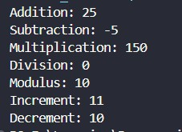
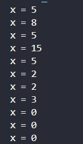
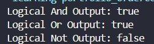
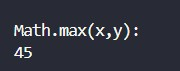
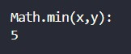
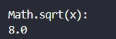
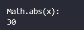
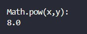
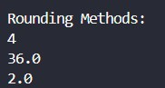
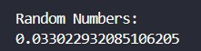

# Operators and Math

## Java Operators

### Arithmetic Operators

#### Addition (x + y)

```java
        System.out.println("Addition: " + (x + y));
```

#### Subtraction (x - y)

```java
        System.out.println("Subtraction: " + (x - y));
```

#### Multiplication (x \* y)

```java
        System.out.println("Multiplication: " + (x * y));
```

#### Division (x / y)

```java
        System.out.println("Division: " + (x / y));
```

#### Modulus (x % y)

```java
        System.out.println("Modulus: " + (x % y));
```

#### Increment (++x)

```java
        System.out.println("Increment: " + (++x));
```

#### Decrement (--x)

```java
        System.out.println("Decrement: " + (--x));
```



### Assignment Operators

#### =

```java
    int x = 5;
```

#### +=

```java
    x += 3;
```

#### -=

```java
    x -= 3;
```

#### \*=

```java
    x *= 3;
```

#### /=

```java
    x /= 3;
```

#### %=

```java
    x %= 3;
```

#### &=

```java
    x &= 3;
```

#### |=

```java
    x |= 3;
```

#### ^=

```java
    x ^= 3;
```

#### >>=

```java
    x >>= 3;
```

#### <<=

```java
    x <<= 3;
```



---

### Logical Operators

#### Logical And (&&)

```java
        System.out.println("Logical And Output: " + (x >= 10 && x <20));
```

#### Logical Or (||)

```java
        System.out.println("Logical Or Output: " + (x>30 || x ==10));
```

#### Logical Not (!)

```java
        System.out.println("Logical Not Output: " + !(x>=10 && x<20));
```



### Operator Precedence

---

## Java Math

### Math.max(x,y)

```java
        System.out.println("\nMath.max(x,y): ");
        System.out.println(Math.max(10,45));
```



### Math.min(x,y)

```java
        System.out.println("\nMath.min(x,y): ");
        System.out.println(Math.min(5,10));
```



### Math.sqrt(x)

```java
        System.out.println("\nMath.sqrt(x): ");
        System.out.println(Math.sqrt(64));
```



### Math.abs(x)

```java
        System.out.println("\nMath.abs(x): ");
        System.out.println(Math.abs(30));
```



### Math.pow(x,y)

```java
        System.out.println("\nMath.pow(x,y): ");
        System.out.println(Math.pow(2,3));
```



### Rounding Methods

```java
        System.out.println("\nRounding Methods: ");
        System.out.println(Math.round(3.6));
        System.out.println(Math.ceil(35.4));
        System.out.println(Math.floor(2.6));
```



### Random Numbers

```java
        System.out.println("\nRandom Numbers: ");
        System.out.println(Math.random());
```



---

## ⚖️ Copyright & Licensing

**Copyright © 2026 T.M.S.U. Thennakoon (Sahan Udara). All rights reserved.**

This documentation, code implementations, structured syllabus, and associated assets are part of the **Java Zero to Hero** learning roadmap, independently curated, structured, and maintained by **Sahan Udara (Mr. Nexora)** under the umbrella brand **SU Nexora**.

- **Author Profiles:** [GitHub](https://github.com/mr-nexora) | [LinkedIn](https://www.linkedin.com/in/mrnexora/)
- **Permitted Use:** This material is strictly intended for personal education, reference, and open-source project showcasing. You are welcome to study, reference, and fork this repository for non-commercial educational purposes.
- **Restrictions:** Unauthorized duplication, plagiarism, re-hosting, or redistribution of these compiled notes, structural curriculum design, and step-by-step explanations on other websites, courses, or commercial media without explicit prior written consent from the author is strictly prohibited.

_All structural updates, code solutions, and verified execution screenshots belong to the author's personal portfolio assets._
