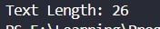
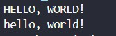
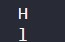
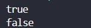
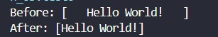
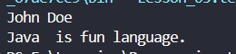

# Working with Strings

## Java Strings

```java
    // Syntax
    String name = "Hello";
```
## String Methods

### Length() Method

```java
    // test1.java
        String text = "ASDFGHJKLQWERTYUIOPZXCVBNM";
        System.out.println("Text Length: " + text.length());
```



### Uppercase() Method
```java
    // test2.java
    System.out.println(txt.toUpperCase());
```

### Lowercase() Method
```java
    // test2.java
    System.out.println(txt.toLowerCase());
```


---
### IndexOf()  Method
```java
    // test3.java
    String txt = "My name is John Doe";
    System.out.println("Index is: " + txt.indexOf("John"));
```


### CharAt() Method
```java
    // test4.java
    System.out.println(txt.charAt(0));
    System.out.println(txt.charAt(3));
```


### equals() Method
```java
    // test5.java
    String txt1 = "Hello";
        String txt2 = "Hello";
        String txt3 = "User";
        
    System.out.println(txt1.equals(txt2));
    System.out.println(txt1.equals(txt3));
```


### trim() Method
```java
    // test6.java
    String txt = "   Hello World!   ";
        System.out.println("Before: [" + txt + "]");
        System.out.println("After: [" + txt.trim() + "]");
```


## Java String Concatenation

### The concat() Method
```java
    // test7.java
    String firstName = "John ";
        String lastName = "Doe";

        String txt1 = "Java ";
        String txt2 = " is";
        String txt3 = " fun";
        String txt4 = " language.";

        System.out.println(firstName.concat(lastName));
        System.out.println(txt1.concat(txt2).concat(txt3).concat(txt4));
```


## Java Special Characters
    Escape character	Result	Description
    \'	'	Single quote
    \"	"	Double quote
    \\	\	Backslash

Code	Result	Try it
\n	New Line	
\t	Tab	
\b	Backspace	
\r	Carriage Return	
\f	Form Feed
---
## ⚖️ Copyright & Licensing

**Copyright © 2026 T.M.S.U. Thennakoon (Sahan Udara). All rights reserved.**

This documentation, code implementations, structured syllabus, and associated assets are part of the **Java Zero to Hero** learning roadmap, independently curated, structured, and maintained by **Sahan Udara (Mr. Nexora)** under the umbrella brand **SU Nexora**.

- **Author Profiles:** [GitHub](https://github.com/mr-nexora) | [LinkedIn](https://www.linkedin.com/in/mrnexora/)
- **Permitted Use:** This material is strictly intended for personal education, reference, and open-source project showcasing. You are welcome to study, reference, and fork this repository for non-commercial educational purposes.
- **Restrictions:** Unauthorized duplication, plagiarism, re-hosting, or redistribution of these compiled notes, structural curriculum design, and step-by-step explanations on other websites, courses, or commercial media without explicit prior written consent from the author is strictly prohibited.

_All structural updates, code solutions, and verified execution screenshots belong to the author's personal portfolio assets._
