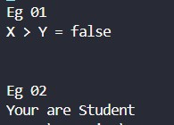
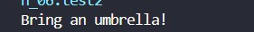
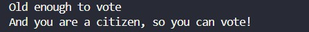

# Booleans and Decision Making

## Java Booleans

```java
    int x = 10;
        int y = 15;
        System.out.println("X > Y = " + (x>y));

        // Eg 02
        boolean isStudent = true;
        if (isStudent) {
            System.out.println("Your are Student");
        }
        else {
            System.out.println("You are NOT a Student");
        }
```



---

## Java If...Else

### if Statement

```syntax
if (condition) {
// block of code to be executed if the condition is true
}
```

```java
    // test2.java
    boolean isRaining = true;

        if (isRaining) {
            System.out.println("Bring an umbrella!");
        }
```



### else Statement

```syntax
if (condition) {
// block of code to be executed if the condition is true
} else {
// block of code to be executed if the condition is false
}
```

```java
    // test3.java
    boolean isRaining = true;

        if (isRaining) {
            System.out.println("Bring an umbrella!");
        }
```


### else if Statement

```syntax
if (condition1) {
// block of code to be executed if condition1 is true
} else if (condition2) {
// block of code to be executed if condition1 is false and condition2 is true
} else {
// block of code to be executed if both conditions are false
}
```

```java
    // test4.java
    int mark = 60;
        if (mark >= 75) {
            System.out.println("Your Grade is A");
        } else if (mark >= 65) {
            System.out.println("Your Grade is B");
        } else if (mark >= 65) {
            System.out.println("Your Grade is C");
        } else if (mark >= 55) {
            System.out.println("Your Grade is D");
        } else if (mark >= 45) {
            System.out.println("Your Grade is E");
        } else {
            System.out.println("You ar Fail");
        }
```


### Short Hand if - else Statement

```syntax
variable = (condition) ? expressionTrue: expressionFalse;
```

```java
    // test5.java

        String result = (isStudent) ? "You are Student" : "You are NOT Student";
        System.out.println(result);

```


#### Nested Ternary

```java
    // test6.java
    int time = 20;
        String result = (time <12) ? "Good Morning"
                      : (time <18) ? "Good Afternoon"
                      : "Good Evening";

        System.out.println(result);
```


### Nested if Statement

```syntax
if (condition1) {
// code to run if condition1 is true
if (condition2) {
// code to run if both condition1 and condition2 are true
}
}
```

```java
    // test7.java
    int age = 20;
        boolean isCitizen = true;

        if (age >= 18) {
            System.out.println("Old enough to vote");

            if (isCitizen) {
                System.out.println("And you are a citizen, so you can vote!");
            } else {
                System.out.println("But you must be a citizen to vote!");
            }

        } else {
            System.out.println("Not old enough to vote");
        }
```

## 

## Java Switch
```syntax
    switch(expression) {
    case x:
        // code block
        break;
    case y:
        // code block
        break;
    default:
        // code block
    }
```
```java
    // test8.java
    int dayNo = 2;

        switch (dayNo) {
            case 1:
                System.out.println("Monday");
                break;
            case 2:
                System.out.println("Tuesday");
                break;
            case 3:
                System.out.println("Wednsday");
                break;
            case 4:
                System.out.println("Thursday");
                break;
            case 5:
                System.out.println("Friday");
                break;
            case 6:
                System.out.println("Saturday");
                break;
            case 7:
                System.out.println("Sunday");
                break;
            default:
                System.out.println("Please add the vaild Input");
        }
```
## 
---

## ⚖️ Copyright & Licensing

**Copyright © 2026 T.M.S.U. Thennakoon (Sahan Udara). All rights reserved.**

This documentation, code implementations, structured syllabus, and associated assets are part of the **Java Zero to Hero** learning roadmap, independently curated, structured, and maintained by **Sahan Udara (Mr. Nexora)** under the umbrella brand **SU Nexora**.

- **Author Profiles:** [GitHub](https://github.com/mr-nexora) | [LinkedIn](https://www.linkedin.com/in/mrnexora/)
- **Permitted Use:** This material is strictly intended for personal education, reference, and open-source project showcasing. You are welcome to study, reference, and fork this repository for non-commercial educational purposes.
- **Restrictions:** Unauthorized duplication, plagiarism, re-hosting, or redistribution of these compiled notes, structural curriculum design, and step-by-step explanations on other websites, courses, or commercial media without explicit prior written consent from the author is strictly prohibited.

_All structural updates, code solutions, and verified execution screenshots belong to the author's personal portfolio assets._
